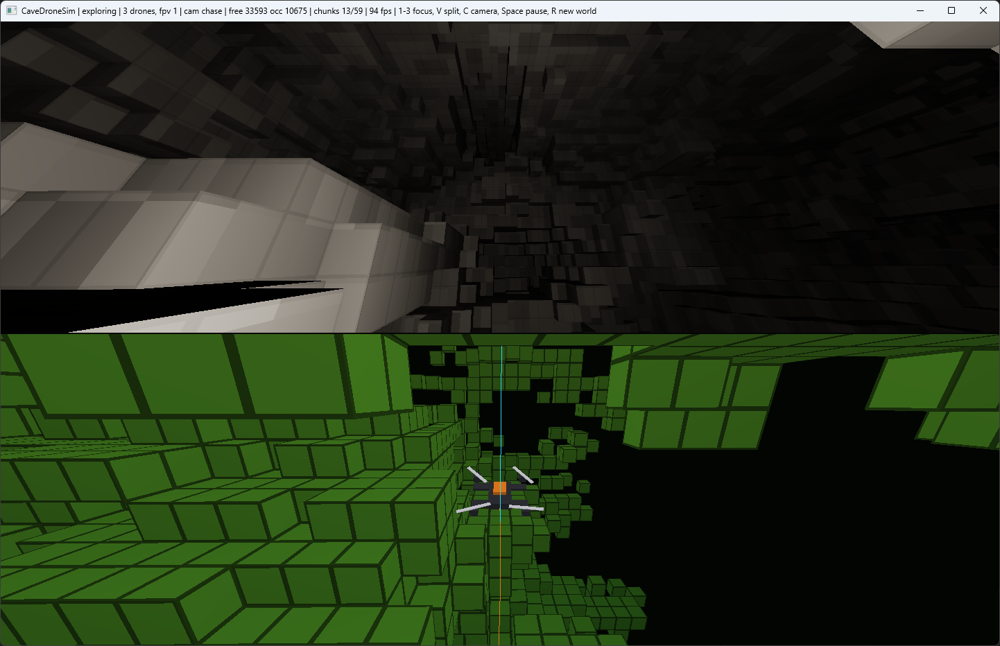

# CaveDroneSim

Autonomous cave exploration drone fleet in C++ / WinAPI / OpenGL 3.3, zero external dependencies.

A fleet of simulated quadrotors wakes up in a procedurally generated cave system with no prior map. A spinning lidar reveals the world into a sparse voxel occupancy map, a frontier-based planner repeatedly picks the nearest boundary between known and unknown space, and the flight controller banks the drone through the tunnels toward it. What you see on screen is only what the drone has discovered so far, rendered as a green voxel point-cloud in the style of industrial inspection drones (Exyn, Flyability).

## Screenshot

## Architecture

The core loop is sense, plan, act:

1. **Sense** (`Lidar`): each frame casts a batch of rays in a Fibonacci-sphere pattern with a random phase, traversing the ground-truth grid with the Amanatides-Woo DDA. The noise model includes Gaussian range noise, dropouts and spurious short returns (dust). Evidence is integrated along the *measured* range, not the true one, exactly like a real fusion pipeline: phantom voxels from outliers appear and later dissolve under contradicting evidence. Rays that merely clip a cell with a short chord right in front of the return integrate nothing there, so grazing-angle noise cannot slowly erode real geometry. The drone never reads the ground truth directly.
2. **Plan** (`Planner`): per agent, breadth-first search over known-safe cells to the nearest exploration frontier, then line-of-sight shortcutting turns the stair-step grid path into smooth diagonals. A frontier only counts as a goal if the unknown region behind it is locally thick, which filters out phantom frontiers created by sensor outliers; otherwise the drone would chase noise. Replans run periodically and immediately whenever new observations block the path ahead. A livelock guard gives up on frontiers the lidar physically cannot resolve, and completion is declared only after several consecutive exhausted searches, because noisy classification can briefly pinch off a passage. After completion the drone plans a path home through the map it built and holds position at the start point.
3. **Act** (`Drone`): simplified quadrotor dynamics. Thrust acts only along the body up axis, so the vehicle must physically bank to accelerate sideways. Cascade: pursuit point on the path -> desired velocity -> desired specific force -> desired attitude plus thrust magnitude -> first-order attitude tracking -> integration with quadratic drag. Speed scales down before sharp turns and near the goal.

## Fleet coordination

All agents integrate lidar evidence into one shared map, an ideal-communication model of map sharing. Coordination is decentralized greedy task allocation with two stabilizers that turned out to matter more than the allocation itself:

- **Goal claims**: an agent skips frontiers within a claim radius of another agent's current goal, so the fleet spreads out. If every remaining frontier is claimed, it retries with claims lifted, which keeps completion detection correct.
- **Goal hysteresis**: an agent keeps its goal while it still borders an exploration frontier instead of re-picking the nearest one every cycle. Without this, symmetric claims make agents swap goals back and forth and the fleet explores slower than a single drone.
- **Goal blacklist**: frontiers the lidar cannot resolve are excluded from goal selection for a while instead of being burned into the shared map, which could seal off whole corridors. The map stays truthful and another drone can resolve the same frontier from a different angle.
- **Separation**: velocity-space repulsion keeps agents apart when paths cross.

With three drones, coverage after four minutes is 1.5x to 4.8x that of a single drone depending on cave topology (branchy caves parallelize well, a single main tunnel forces a convoy).

## Voxel storage and rendering

- **Ground truth** (`World`): dense bit grid, generated by carving fBm noise chambers plus a network of random-walker tunnels, then a flood fill removes cavities unreachable from the start chamber.
- **Observed map** (`VoxelMap`): sparse chunked probabilistic occupancy grid, 16^3 chunks allocated lazily in a hash map. Each cell stores an integer log-odds value (OctoMap style); classification into Unknown / Free / Occupied is derived from thresholds. Memory grows only with what the drone has seen, so the scheme scales to unbounded worlds.
- **Rendering** (`VoxelRenderer`): one interleaved VBO per chunk, greedy meshing (`Meshing`) merges coplanar visible faces into maximal rectangles, only dirty chunks rebuilt (budgeted per frame). Flat surfaces collapse up to 256x; the organic cave surface compresses about 2.3x, halving vertex memory. The uv of a merged quad spans the rectangle in voxel units and the fragment shaders use fract(uv), so the per-voxel grid survives merging. The shader draws grid edges, a height-based green palette and exponential fog into the cave darkness. The ground-truth FPV mesh goes through the same greedy mesher.

Safety clearance for planning requires the full 26-neighborhood of a cell to be known free, which keeps the path centerline a full voxel away from any wall and absorbs controller overshoot.

## Robustness layers

Flying through a noisy probabilistic map needs more than a planner. The control stack is layered, and every layer below was added because a specific failure showed up in trajectory stress testing:

- **Pursuit chord gate**: the follower only advances its pursuit point while the straight chord from the drone to it passes through known-free cells (exact DDA enumeration, not sampling). Stops corner cutting across walls the map already knows about.
- **Reflex layer**: any motion aimed at a known-occupied cell within a probe distance commands a gentle retreat, not a stop; alternating accelerate/stop ratchets a hovering drone into a wall a millimeter per cycle. Works at hover-drift speeds via a minimum probe length.
- **Latched station keeping**: when the chord gate pins the pursuit point, the drone anchors to a captured position with real stiffness; commanding velocity toward a point that coincides with the drone gives zero stiffness and millimeter drift integrates into the floor over minutes.
- **Careful mode**: sustained reflex firing shrinks lookahead and speed for a few seconds so the drone crawls the polyline exactly through geometry it cannot round at cruise settings.
- **Route commitment on return**: a noise-flickering pinch point otherwise makes the drone thrash between the direct route and a detour for minutes; the chord gate makes following a stale path safe, so replanning happens only when progress toward the path end genuinely stalls.
- **Chord-validated snapping**: when the planner snaps the start or goal to the nearest safe cell, the chosen cell must be reachable by a straight free chord, otherwise the first or last path leg clips a wall corner and deadlocks the follower.
- **Degraded return tier**: noise-frozen cells can sever full-clearance connectivity in corridors nobody will rescan; if the safe graph does not reach home, the return path is planned through merely-free cells, guarded at flight time by the layers above.

## Modern C++

The code targets the latest language standard the toolchains provide: `/std:c++latest` under MSVC (v145) and `-std=c++2b` under GCC 13 MinGW. Initialization errors propagate through `std::expected<void, std::string>` chains up to a single message box, buffers cross API boundaries as `std::span`, template visitors and predicates are constrained with concepts, text goes through `std::format` and `std::string_view`, timing uses `std::chrono`, and the three hand-rolled copies of the Amanatides-Woo voxel traversal collapsed into one `VoxelDda` class shared by the raycaster, the occlusion query, the lidar integration, the chord gate and the reflex probe.

## Building

MSVC (from a x64 Native Tools prompt):

    build_msvc.bat

MinGW-w64 (MSYS2, or cross-compile from Linux):

    ./build_mingw.sh

No libraries to install. Links against opengl32, gdi32, user32 only.

## Visual layer

- **FPV HUD**: crosshair, an artificial horizon that counter-rotates with the physical roll of the vehicle, a compass ribbon with a heading readout, speed and altitude blocks, vehicle id and mission status. All of it is screen-space lines with a built-in vector line font, no textures. H toggles it.
- **Point cloud mode**: the raw measured lidar returns accumulate in a 400k-point GPU ring buffer and render as distance-attenuated points, the way real SLAM tooling looks. G cycles voxels / point cloud / both.
- **Holographic map shading**: grazing-angle rim glow, a lidar scan pulse expanding from the focused drone every few seconds, and freshly rebuilt chunks that glow and cool down, so the map visibly lives where the sensors are writing.
- **Headlight dust**: additive dust motes drift around the focused drone in the FPV pane, lit by the same falloff as the rock, so the beam reads in the air like real cave footage.

## Split view

The default layout mirrors industrial inspection drone footage: the top pane is the onboard FPV camera rendering the ground-truth cave, pitch black except for the drone's headlight, banking into turns with the physical attitude of the vehicle. The bottom pane is the reconstructed voxel map. The contrast between what the drone sees and what it knows is the whole point. V toggles between split view and full map view. The ground-truth surface is meshed once per world generation into chunks and drawn with the same frustum culling as the map.

## Overview inset

A small inset in the bottom-right corner shows the entire explored map at once, slowly rotating around the vertical axis, with a colored vertical beacon marking each drone. The view auto-fits the bounds of everything meshed so far, with smoothed re-framing as the map grows, and uses almost no fog since the camera is far away by design. It keeps rotating while the simulation is paused. M toggles it.

## Camera

Chase mode (default) flies behind the drone and smoothly aligns with the direction of flight. Frustum culling skips voxel chunks outside the view, and a DDA raycast against the observed map pulls the camera in whenever a discovered wall would block the line of sight to the drone (fast pull-in, slow release, no popping). Undiscovered geometry is not rendered, so it intentionally does not occlude.

## Controls

- 1..3: switch camera and FPV focus between drones
- M: toggle the rotating overview inset
- G: cycle map style (voxels / point cloud / both)
- H: toggle the FPV HUD
- V: toggle split view (FPV + map) / full map view
- C: toggle chase / orbit camera
- Left mouse drag: rotate (orbit mode)
- Mouse wheel: zoom (both modes)
- Space: pause
- R: regenerate world with a new seed
- Esc: quit

Window title shows live stats: explored cell counts, chunk count, speed, FPS.

## Headless test

The simulation core is platform-independent. `tests/HeadlessTest.cpp` runs the full multi-agent sense-plan-act loop without rendering (agent count, seed and duration as arguments) and asserts no NaNs, no penetration of solid voxels, meaningful exploration progress and that every drone returns to its pad. `tests/CameraFrustumTest.cpp` covers the frustum plane extraction and the chase camera occlusion pull-in. `tests/GreedyMeshTest.cpp` rasterizes the quads emitted by the greedy mesher into coverage grids and verifies against a naive face enumeration that every visible face is covered exactly once, over hand-built and random occupancy patterns:

    g++ -O2 -std=c++17 tests/HeadlessTest.cpp src/World.cpp src/VoxelMap.cpp \
        src/Lidar.cpp src/Planner.cpp src/Drone.cpp -Isrc -o headless_test

## License

MIT License

Copyright (c) 2026 Mykhailo Makarov

Permission is hereby granted, free of charge, to any person obtaining a copy
of this software and associated documentation files (the "Software"), to deal
in the Software without restriction, including without limitation the rights
to use, copy, modify, merge, publish, distribute, sublicense, and/or sell
copies of the Software, and to permit persons to whom the Software is
furnished to do so, subject to the following conditions:

The above copyright notice and this permission notice shall be included in all
copies or substantial portions of the Software.

THE SOFTWARE IS PROVIDED "AS IS", WITHOUT WARRANTY OF ANY KIND, EXPRESS OR
IMPLIED, INCLUDING BUT NOT LIMITED TO THE WARRANTIES OF MERCHANTABILITY,
FITNESS FOR A PARTICULAR PURPOSE AND NONINFRINGEMENT. IN NO EVENT SHALL THE
AUTHORS OR COPYRIGHT HOLDERS BE LIABLE FOR ANY CLAIM, DAMAGES OR OTHER
LIABILITY, WHETHER IN AN ACTION OF CONTRACT, TORT OR OTHERWISE, ARISING FROM,
OUT OF OR IN CONNECTION WITH THE SOFTWARE OR THE USE OR OTHER DEALINGS IN THE
SOFTWARE.

## Support

If you found this project interesting or useful, you can support my work:

